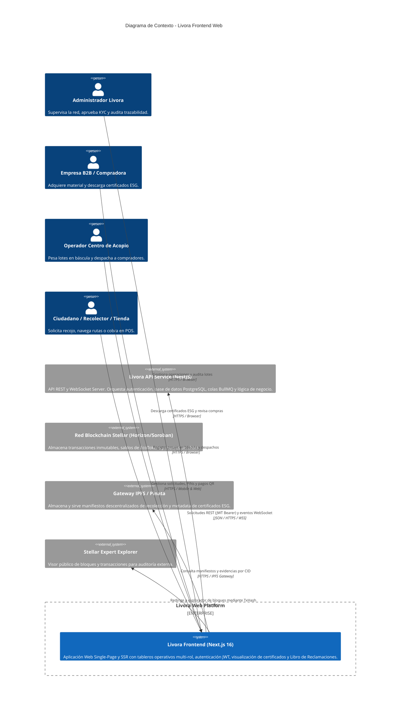
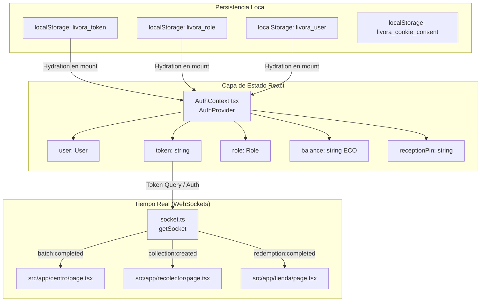
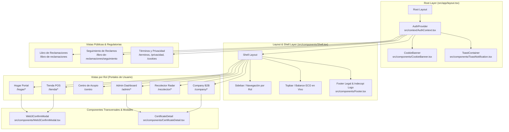
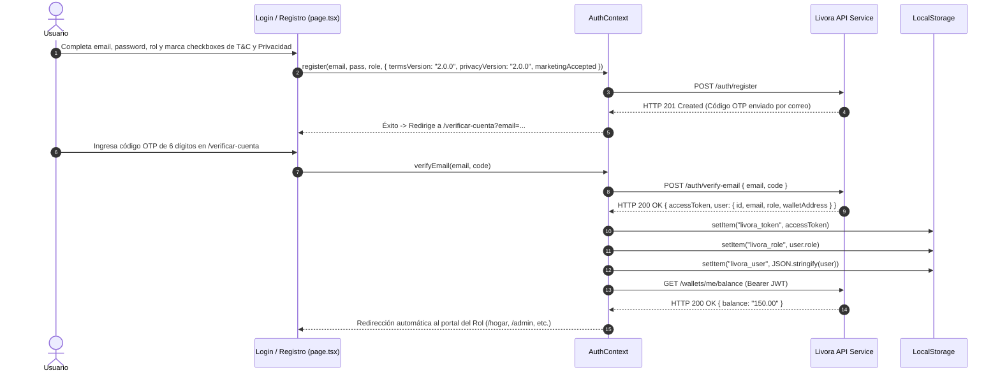
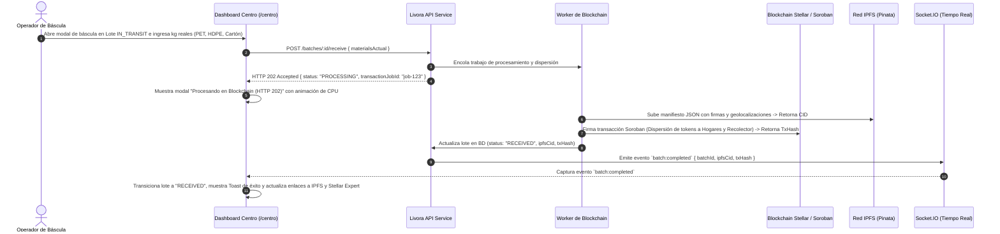
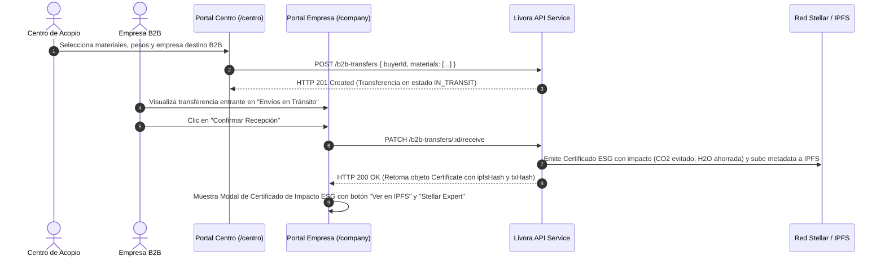
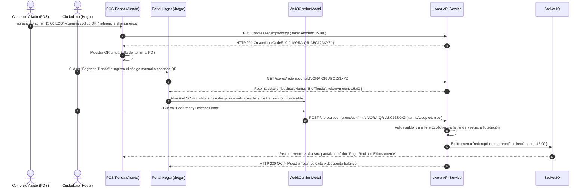
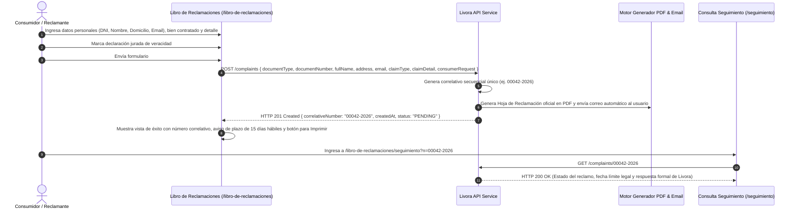
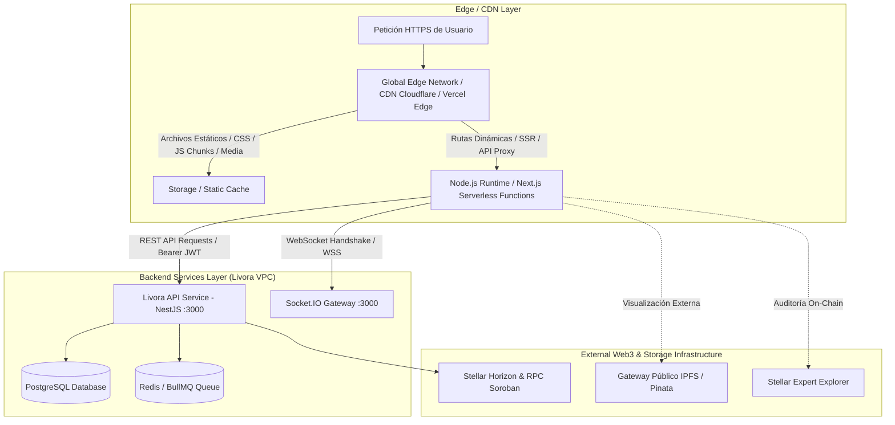
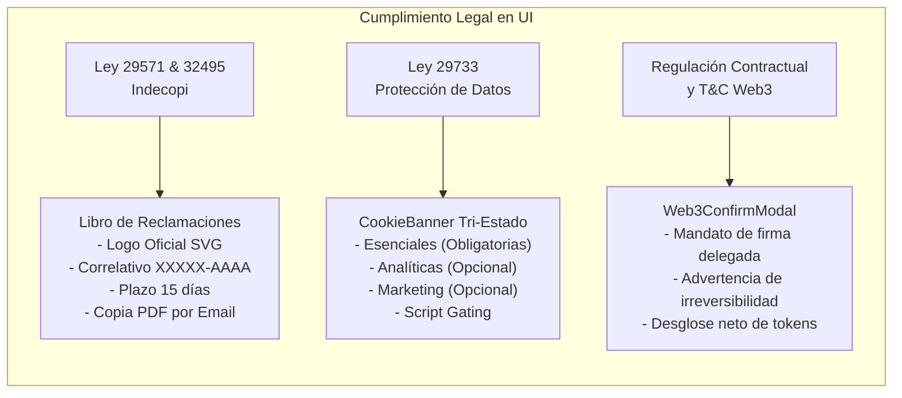

# Documento de Arquitectura de Software (arc42)
# Frontend Web — Plataforma Livora

**Versión del Documento:** 2.0.0  
**Fecha:** Agosto 2026  
**Estado:** Actualizado y Alineado a Red Stellar / Soroban  
**Autor:** Principal Frontend Architect & Staff UI/UX Engineer  
**Repositorio:** `Livora-frontend`  
**Estándar de Arquitectura:** arc42 Template (v8.0)

---

## Control de Versiones del Documento

| Versión | Fecha | Autor | Descripción de Cambios |
| :--- | :--- | :--- | :--- |
| 1.0.0 | Julio 2026 | Equipo Core Livora | Versión inicial de especificación y bocetos UI. |
| 2.0.0 | Agosto 2026 | Principal Frontend Architect | Reestructuración total bajo estándar arc42, eliminación de deuda técnica histórica (EVM/Arbitrum/Supabase), integración de Red Stellar/Soroban, flujos industriales de pesaje, Libro de Reclamaciones (Indecopi Ley 29571 & Ley 32495), banner de cookies (Ley 29733) y modales de confirmación Web3. |

---

## Tabla de Contenidos

1. [Introducción y Objetivos](#1-introducción-y-objetivos)
   - [1.1 Requisitos Clave y Metas de Negocio](#11-requisitos-clave-y-metas-de-negocio)
   - [1.2 Objetivos de Calidad](#12-objetivos-de-calidad)
   - [1.3 Partes Interesadas (Stakeholders)](#13-partes-interesadas-stakeholders)
2. [Restricciones de Arquitectura](#2-restricciones-de-arquitectura)
   - [2.1 Restricciones Técnicas](#21-restricciones-técnicas)
   - [2.2 Restricciones de Entorno y Compatibilidad](#22-restricciones-de-entorno-y-compatibilidad)
   - [2.3 Restricciones Legales y Regulatorias (Perú)](#23-restricciones-legales-y-regulatorias-perú)
3. [Contexto y Alcance](#3-contexto-y-alcance)
   - [3.1 Delimitación del Sistema](#31-delimitación-del-sistema)
   - [3.2 Diagrama de Contexto del Sistema](#32-diagrama-de-contexto-del-sistema)
   - [3.3 Interfaces Externas](#33-interfaces-externas)
4. [Estrategia de Arquitectura](#4-estrategia-de-arquitectura)
   - [4.1 Paradigma de Renderizado](#41-paradigma-de-renderizado)
   - [4.2 Gestión del Estado Global y Local](#42-gestión-del-estado-global-y-local)
   - [4.3 Estrategia de Enrutamiento y Protección de Rutas](#43-estrategia-de-enrutamiento-y-protección-de-rutas)
   - [4.4 Consumo de APIs y Gestión de Sesión](#44-consumo-de-apis-y-gestión-de-sesión)
5. [Vista de Bloques / Estructura del Código (Building Block View)](#5-vista-de-bloques--estructura-del-código-building-block-view)
   - [5.1 Estructura General de Carpetas (Nivel 1)](#51-estructura-general-de-carpetas-nivel-1)
   - [5.2 Detalle de Módulos por Actor de Negocio (Nivel 2)](#52-detalle-de-módulos-por-actor-de-negocio-nivel-2)
   - [5.3 Diagrama de Bloques UI del Cliente](#53-diagrama-de-bloques-ui-del-cliente)
6. [Vista de Nivel de Ejecución (Dynamic View)](#6-vista-de-nivel-de-ejecución-dynamic-view)
   - [6.1 Flujo de Autenticación, Consentimiento y Persistencia de Sesión](#61-flujo-de-autenticación-consentimiento-y-persistencia-de-sesión)
   - [6.2 Flujo de Pesaje y Liquidación Asíncrona en Centro de Acopio](#62-flujo-de-pesaje-y-liquidación-asíncrona-en-centro-de-acopio)
   - [6.3 Flujo de Despacho B2B y Emisión de Certificados ESG](#63-flujo-de-despacho-b2b-y-emisión-de-certificados-esg)
   - [6.4 Flujo de Cobro POS en Tienda y Confirmación Web3](#64-flujo-de-cobro-pos-en-tienda-y-confirmación-web3)
   - [6.5 Flujo de Libro de Reclamaciones Virtual](#65-flujo-de-libro-de-reclamaciones-virtual)
7. [Vista de Despliegue (Deployment View)](#7-vista-de-despliegue-deployment-view)
   - [7.1 Infraestructura de Despliegue](#71-infraestructura-de-despliegue)
   - [7.2 Variables de Entorno](#72-variables-de-entorno)
   - [7.3 Diagrama de Despliegue](#73-diagrama-de-despliegue)
8. [Conceptos Transversales (Cross-Cutting Concepts)](#8-conceptos-transversales-cross-cutting-concepts)
   - [8.1 UX/UI & Sistema de Diseño](#81-uxui--sistema-de-diseño)
   - [8.2 Seguridad en Frontend](#82-seguridad-en-frontend)
   - [8.3 Manejo de Errores y Feedback al Usuario](#83-manejo-de-errores-y-feedback-al-usuario)
   - [8.4 Cumplimiento Normativo Integrado (Compliance-by-Design)](#84-cumplimiento-normativo-integrado-compliance-by-design)
9. [Auditoría de Inconsistencias y Fugas Técnicas (Limpieza de Deuda Técnica)](#9-auditoría-de-inconsistencias-y-fugas-técnicas-limpieza-de-deuda-técnica)
   - [9.1 Diagnóstico de Hallazgos Históricos](#91-diagnóstico-de-hallazgos-históricos)
   - [9.2 Matriz de Corrección y Limpieza de Código / Documentación](#92-matriz-de-corrección-y-limpieza-de-código--documentación)
10. [Conclusiones y Próximos Pasos](#10-conclusiones-y-próximos-pasos)

---

## 1. Introducción y Objetivos

### 1.1 Requisitos Clave y Metas de Negocio

Livora es un ecosistema digital de economía circular que incentiva el reciclaje mediante la trazabilidad física respaldada en la blockchain Stellar/Soroban y la emisión de tokens de recompensa (*EcoTokens*). La aplicación web (`Livora-frontend`) proporciona interfaces adaptadas para seis roles operativos clave:

1. **Administración (`ADMIN`):** Monitoreo global de operaciones, trazabilidad integral de lotes, auditoría de certificados ESG, estado de infraestructura blockchain Stellar e IPFS, supervisión de inventarios y aprobación de KYC.
2. **Empresas B2B / Compradoras (`EMPRESA_B2B`):** Tablero corporativo de métricas de impacto ambiental (CO₂ evitado, agua ahorrada), recepción de transferencias de material consolidado, descarga de manifiestos IPFS y visualización de certificados ESG inmutables.
3. **Centros de Acopio y Almacenes (`CENTRO_ACOPIO` / `ALMACEN`):** Estación de pesaje en báscula industrial (PET, HDPE, Cartón, Vidrio, Aluminio), confirmación y liquidación asíncrona de lotes en blockchain (HTTP 202 Accepted + WebSockets), gestión de PIN de recepción para recolectores, despacho multi-material a compradores B2B y trazabilidad por lote/material.
4. **Hogares / Ciudadanos (`HOGAR`):** Creación de solicitudes de recolección georreferenciadas con evidencia fotográfica y estimación de residuos, generación de PIN de entrega para recolectores, consulta de balance en EcoTokens y pago/canje en comercios aliados mediante QR o código alfanumérico.
5. **Recolectores Urbanos (`RECOLECTOR`):** Radar de solicitudes geolocalizadas por radio (5km, 10km, 50km), aceptación de recolecciones, verificación física con PIN numérico de 4 dígitos, consolidación de carga en camión y traslado a centros de acopio.
6. **Comercios Aliados / Tiendas (`TIENDA`):** Terminal de punto de venta (POS) para cobrar en EcoTokens mediante código QR dinámico o ID manual del ciudadano, historial de canjes y solicitud de liquidación bancaria (*cash-out*) a cuenta bancaria/CCI en moneda fiduciaria (PEN).

### 1.2 Objetivos de Calidad

| Meta de Calidad | Escenario / Métrica | Solución Arquitectónica |
| :--- | :--- | :--- |
| **Rendimiento** | First Contentful Paint (FCP) < 1.2s; Time to Interactive (TTI) < 2.0s en redes 4G estándar. | Arquitectura basada en Next.js App Router con Server Components estáticos donde aplique y Client Components ligeros con carga diferida. |
| **Seguridad en Cliente** | Cero fuga de claves privadas criptográficas; prevención total de ataques XSS y CSRF; saneamiento de errores. | Modelo de custodia delegada en backend; ningún componente cliente almacena llaves privadas; interceptor Axios con Bearer JWT sanitizado; desinfección de mensajes de error RFC 7807. |
| **Experiencia de Usuario (UX/UI)** | Interfaz responsiva, consistente en tema oscuro (*dark-mode*) con respuesta visual instantánea ante eventos asíncronos. | Sistema de diseño basado en Tailwind CSS y CSS Grid/Flexbox moderno, retroalimentación mediante `ToastContainer`, modales accesibles y badges dinámicos. |
| **Confiabilidad en Tiempo Real** | Actualización inmediata del estado de lotes (`batch:completed`), solicitudes (`collection:created`) y pagos (`redemption:completed`). | Conexión WebSocket mediante Socket.IO con token de autenticación dinámico y reintento automático de reconexión. |
| **Cumplimiento Legal y Regulatorio** | 100% de conformidad con normativas peruanas (Indecopi Ley 29571/32495 y ANPD Ley 29733). | Libro de Reclamaciones digital con logotipo oficial, generación de correlativo (XXXXX-AAAA), aviso de envío PDF y plazo legal de 15 días; banner de cookies tri-estado; consentimiento explícito en registro. |

### 1.3 Partes Interesadas (Stakeholders)

| Rol / Actor | Interés Principal | Vista de Interés en el Frontend |
| :--- | :--- | :--- |
| **Oficial de Cumplimiento Legal** | Cumplimiento estricto con Indecopi (Libro de Reclamaciones), ANPD (Protección de Datos) y T&C Web3. | `/libro-de-reclamaciones`, `/terminos`, `/privacidad`, `/cookies` |
| **Gerente de Operaciones** | Monitoreo de flujo de camiones, lotes procesados, inventario en centros y tiempos de respuesta. | `/admin`, `/admin/batches`, `/admin/inventory` |
| **Jefe de Planta / Báscula** | Agilidad en pesaje de camiones, validación de materiales y emisión de órdenes de liquidación on-chain. | `/centro` |
| **Empresa Compradora B2B** | Reportes auditables de sostenibilidad corporativa (ESG) respaldados por transacciones Stellar e IPFS. | `/company`, `/company/certificates`, `/company/traceability` |
| **Recolector / Ciudadano** | Interfaz intuitiva móvil, visualización clara de EcoTokens y canjes sin fricción. | `/hogar`, `/recolector`, `/tienda` |

---

## 2. Restricciones de Arquitectura

### 2.1 Restricciones Técnicas

- **Framework Web:** Next.js 16.3.0 (App Router con React Server Components y Client Components).
- **Librería UI & Core:** React 19.1.1, React DOM 19.1.1.
- **Lenguaje:** TypeScript 5.7.0 (modo estricto, sin `any` innecesarios en contratos públicos).
- **Estilos:** Tailwind CSS con variables personalizadas CSS (`globals.css`), soporte integral de diseño responsivo.
- **Iconografía:** Lucide React 1.30.0.
- **Cliente HTTP:** Axios 1.19.0 con interceptores de solicitud para inyección automática de tokens JWT.
- **Tiempo Real:** `socket.io-client` 4.8.3 para eventos push del servidor.
- **Generación de QR:** `qrcode.react` 4.2.0 (SVG vectoriales de alta precisión para escáneres ópticos).
- **Monitoreo de Errores:** `@sentry/nextjs` 10.70.0 configurado en cliente y servidor.

### 2.2 Restricciones de Entorno y Compatibilidad

- **Navegadores Soportados:** Chrome (>= 90), Firefox (>= 88), Safari (>= 14), Microsoft Edge (>= 90).
- **Dispositivos:** Responsive Web Design compatible con pantallas móviles (360px+), tablets (768px+) y escritorios (1024px, 1440px+).
- **Node.js Runtime (para compilación y SSR):** Node.js LTS (>= 20.x).

### 2.3 Restricciones Legales y Regulatorias (Perú)

- **Ley N.º 29733 (Protección de Datos Personales - ANPD):** El registro y perfilamiento de usuarios debe informar expresamente la existencia del banco de datos *"Usuarios de la Plataforma"*, canales para derechos ARCO (`privacidad@livora.pe`) y checkboxes de consentimiento desmarcados por defecto.
- **Ley N.º 29571 (Código de Protección y Defensa del Consumidor) y Ley N.º 32495:** Obligatoriedad de enlace visible y permanente en el pie de página (`Footer`) y vistas de perfil hacia el *Libro de Reclamaciones Virtual*, con logotipo oficial de Indecopi, formulario con datos del reclamante/bien contratado, número correlativo único (XXXXX-AAAA), notificación automática en PDF y plazo legal de 15 días hábiles improrrogables.
- **Monedero Web3 y Transacciones Stellar:** El frontend debe advertir explícitamente sobre el mandato de delegación de firma en transacciones Stellar, la irreversibilidad de las transferencias on-chain y la naturaleza de los EcoTokens como unidades de recompensa no reembolsables por moneda fiat fuera de los canales autorizados.

---

## 3. Contexto y Alcance

### 3.1 Delimitación del Sistema

El frontend web de Livora es la capa de presentación e interacción humana de la plataforma. **No ejecuta nodos blockchain en el cliente ni almacena claves privadas.** Todas las operaciones criptográficas (firma de transacciones Soroban/Stellar, anclaje de manifiestos en IPFS y dispersión de tokens) son solicitadas a través de la API REST (`Livora-api-service`), la cual gestiona la bóveda segura (*Key Vault*) y la orquestación asíncrona mediante colas de tareas.

### 3.2 Diagrama de Contexto del Sistema



### 3.3 Interfaces Externas

1. **`Livora-api-service` (Backend Principal):**
   - Protocolo: REST sobre HTTPS y WebSockets sobre WSS.
   - Autenticación: Tokens JWT en cabecera `Authorization: Bearer <token>`.
   - Formato de intercambio: JSON estándar, errores con estructura `RFC 7807 Problem Details`.
2. **IPFS Gateway (`https://ipfs.io/ipfs/{cid}`):**
   - Protocolo: HTTPS GET.
   - Propósito: Renderizado y descarga de manifiestos JSON de lotes y metadata estructurada de certificados ESG.
3. **Stellar Expert (`https://stellar.expert/explorer/testnet/tx/{txHash}`):**
   - Protocolo: Enlace de navegación externa segura (`rel="noreferrer"`).
   - Propósito: Transparencia total permitiendo a empresas B2B y auditores verificar recibos digitales en la blockchain Stellar.

---

## 4. Estrategia de Arquitectura

### 4.1 Paradigma de Renderizado

Livora implementa una estrategia híbrida aprovechando las capacidades de **Next.js 16 App Router**:

- **Server Components (RSC):** Utilizados para el layout raíz (`layout.tsx`), definición de metadatos SEO/OpenGraph y páginas estáticas de marco legal (`/terminos`, `/privacidad`, `/cookies`).
- **Client Components (`"use client"`):** Utilizados en todos los dashboards interactivos (`/admin/*`, `/company/*`, `/centro/*`, `/hogar/*`, `/recolector/*`, `/tienda/*`) para:
  - Mantener la reactividad de estados locales y formularios complejos.
  - Gestionar el ciclo de vida de WebSockets (Socket.IO).
  - Interactuar con APIs del navegador (Geolocalización, Cámara, LocalStorage, `window.print`).
  - Renderizar componentes interactivos de confirmación modal (`Web3ConfirmModal`, `CookieBanner`).

### 4.2 Gestión del Estado Global y Local



- **`AuthContext` (`src/context/AuthContext.tsx`):** Centraliza la identidad del usuario, token JWT, rol activo, saldo en EcoTokens y PIN de recepción. Al iniciar la aplicación, hidrata el estado desde `localStorage`. Si la API responde con `401 Unauthorized`, purga la sesión y redirige al login.
- **Estado Local de Vista (React `useState` / `useEffect`):** Cada página gestiona su estado transaccional (filtros de lotes, formularios de báscula, modales de confirmación Web3, líneas de despacho B2B).
- **Sincronización Polling Fallback:** En páginas con flujos asíncronos (ej. Báscula en `/centro`), si existen lotes en estado `PROCESSING`, se ejecuta un intervalo de sondeo cada 4.5 segundos como respaldo ante interrupciones de WebSocket.

### 4.3 Estrategia de Enrutamiento y Protección de Rutas

- **Shell Guard (`src/components/Shell.tsx`):** Componente envoltorio principal para todas las vistas autenticadas. Verifica la existencia de `livora_token`. Si no está presente, fuerza la redirección a `/`.
- **Enrutamiento por Rol:** Tras el login exitoso en `src/app/page.tsx`, el usuario es redirigido automáticamente a su espacio de trabajo correspondiente:
  - `ADMIN` $\rightarrow$ `/admin`
  - `EMPRESA_B2B` $\rightarrow$ `/company`
  - `CENTRO_ACOPIO` / `ALMACEN` $\rightarrow$ `/centro`
  - `HOGAR` $\rightarrow$ `/hogar`
  - `RECOLECTOR` $\rightarrow$ `/recolector`
  - `TIENDA` $\rightarrow$ `/tienda`

### 4.4 Consumo de APIs y Gestión de Sesión

- **Instancia Axios Centralizada (`src/lib/api.ts`):** Configurada con `baseURL: process.env.NEXT_PUBLIC_API_BASE_URL` y `timeout: 10000ms` (extendido a 30000ms en Libro de Reclamaciones para generación de PDF).
- **Interceptor de Solicitud:** Inserta automáticamente la cabecera `Authorization: Bearer <token>` recuperando el token activo de `localStorage`.
- **Mapeo de Errores RFC 7807 (`ToastNotification.tsx`):** Captura las respuestas estructuradas de error del backend (`statusCode`, `message`, `error`) y las traduce a mensajes en lenguaje natural orientados al usuario final, ocultando trazas de servidor o detalles técnicos internos.

---

## 5. Vista de Bloques / Estructura del Código (Building Block View)

### 5.1 Estructura General de Carpetas (Nivel 1)

```
Livora-frontend/
├── .env.example                # Plantilla de variables de entorno públicas y privadas
├── .env.local                  # Configuración local de endpoints y servicios
├── next.config.ts              # Configuración del compilador Next.js y React Strict Mode
├── tsconfig.json               # Configuración del compilador TypeScript con path alias (@/*)
├── package.json                # Dependencias y scripts de construcción (build, dev, typecheck)
├── sentry.client.config.ts     # Configuración Sentry para errores del navegador
├── sentry.server.config.ts     # Configuración Sentry para errores del servidor SSR
└── src/
    ├── app/                    # Next.js App Router (Rutas, páginas, layouts y error boundaries)
    ├── components/             # Componentes modulares reutilizables de UI y diseño
    ├── context/                # Proveedores de estado global (AuthContext)
    └── lib/                    # Clientes de API, WebSockets, tipos TypeScript y utilidades
```

### 5.2 Detalle de Módulos por Actor de Negocio (Nivel 2)

```
src/app/
├── page.tsx                             # Portada, Iniciar Sesión y Registro con consentimientos
├── layout.tsx                           # Layout raíz con AuthProvider y CookieBanner
├── globals.css                          # Estilos globales, variables de color y temas oscuros
├── error.tsx / global-error.tsx         # Error boundaries estándar y críticos
├── not-found.tsx                        # Vista 404 personalizada con estilo Livora
├── verificar-cuenta/page.tsx            # Verificación OTP de correo electrónico
├── recuperar-contrasena/page.tsx        # Solicitud de código de restablecimiento
├── restablecer-contrasena/page.tsx      # Ingreso de nueva contraseña segura
├── perfil/page.tsx                      # Gestión de perfil, coordenadas y cambio de credenciales
│
├── admin/                               # Portal Administrativo
│   ├── page.tsx                         # Dashboard general, KPIs, lotes auditados y certificados
│   ├── batches/                         # Catálogo de lotes estilo marketplace con filtros
│   │   ├── page.tsx                     # Grid responsivo de lotes (Open/In Transit/Received)
│   │   └── [id]/page.tsx                # Detalle del lote, manifiesto IPFS y prueba Stellar
│   ├── certificates/                    # Certificados ESG emitidos a nivel de plataforma
│   │   ├── page.tsx                     # Listado de certificados emitidos
│   │   └── [id]/page.tsx                # Vista de detalle con cálculo de CO2 y agua ahorrada
│   ├── inventory/page.tsx               # Stock consolidado por tipo de material en la red
│   ├── users-kyc/page.tsx               # Bandeja de aprobación y verificación KYC de usuarios
│   └── blockchain/page.tsx              # Monitor de infraestructura, salud de red y latencia
│
├── company/                             # Portal Corporativo B2B
│   ├── page.tsx                         # Resumen ESG corporativo, recepción de envíos y métricas
│   ├── purchases/page.tsx               # Historial de compras de lotes consolidados
│   ├── certificates/                    # Gestión de certificados verdes propios
│   └── traceability/page.tsx            # Cadena de custodia visual completa (Paso a Paso)
│
├── centro/                              # Portal Centro de Acopio y Almacén
│   └── page.tsx                         # Báscula industrial, PIN de recepción, despacho B2B
│
├── hogar/                               # Portal Ciudadano / Hogar
│   ├── page.tsx                         # Registro de recolección, PIN de entrega y canje POS
│   ├── historial/page.tsx               # Historial completo de solicitudes de reciclaje
│   ├── transfers/page.tsx               # Extracto de movimientos de EcoTokens
│   └── perfil/page.tsx                  # Datos del hogar y georreferenciación domiciliaria
│
├── recolector/                          # Portal Recolector Urbano
│   ├── page.tsx                         # Radar de recolecciones, verificación PIN y despacho camión
│   ├── historial/page.tsx               # Historial de lotes entregados y tokens ganados
│   └── transfers/page.tsx               # Historial de transacciones de billetera
│
├── tienda/                              # Portal Comercio Aliado (POS)
│   ├── page.tsx                         # Configuración comercial, cobro POS QR y retiro bancario
│   └── historial/page.tsx               # Historial de canjes y liquidaciones fiduciarias
│
├── libro-de-reclamaciones/              # Cumplimiento Indecopi (Ley 29571 / 32495)
│   ├── page.tsx                         # Hoja de Reclamación Virtual con logotipo oficial
│   └── seguimiento/page.tsx             # Consulta en tiempo real por número correlativo
│
├── terminos/page.tsx                    # Términos y Condiciones de Uso Web3
├── privacidad/page.tsx                  # Política de Privacidad y Tratamiento de Datos (Ley 29733)
└── cookies/page.tsx                     # Política de Cookies detallada
```

### 5.3 Diagrama de Bloques UI del Cliente



---

## 6. Vista de Nivel de Ejecución (Dynamic View)

### 6.1 Flujo de Autenticación, Consentimiento y Persistencia de Sesión

Este flujo describe cómo un usuario se registra aceptando los documentos legales requeridos por la legislación peruana, valida su correo mediante OTP e inicia sesión obteniendo su token Bearer JWT.



### 6.2 Flujo de Pesaje y Liquidación Asíncrona en Centro de Acopio

Describe la recepción física de un camión en el centro de acopio, el pesaje en báscula, el envío asíncrono con respuesta `202 Accepted` y la resolución on-chain notificada por WebSockets.



### 6.3 Flujo de Despacho B2B y Emisión de Certificados ESG

Describe el despacho de inventario consolidado desde un centro de acopio hacia una empresa compradora y la generación automática de la constancia ambiental verificable.



### 6.4 Flujo de Cobro POS en Tienda y Confirmación Web3

Describe el cobro de bienes o servicios en comercios aliados utilizando EcoTokens, implementando la pantalla modal de confirmación legal mandataria.



### 6.5 Flujo de Libro de Reclamaciones Virtual

Describe el registro formal de quejas o reclamos en cumplimiento estricto con el Código de Protección y Defensa del Consumidor de Indecopi.



---

## 7. Vista de Despliegue (Deployment View)

### 7.1 Infraestructura de Despliegue

El frontend de Livora está diseñado para ser desplegado en plataformas Edge / Serverless globales (como **Vercel** o **AWS Amplify**) o contenerizado en **Docker** para entornos On-Premise o Kubernetes.



### 7.2 Variables de Entorno

| Variable | Tipo | Requerida | Propósito / Ejemplo |
| :--- | :--- | :--- | :--- |
| `NEXT_PUBLIC_API_BASE_URL` | String | **Sí** | URL base de la API REST y Socket.IO (ej. `http://localhost:3000` o `https://api.livora.pe`). |
| `NEXT_PUBLIC_SENTRY_DSN` | String | Opcional | DSN del proyecto en Sentry para monitoreo de telemetría y excepciones en cliente. |
| `NEXT_PUBLIC_APP_ENV` | String | Opcional | Entorno de ejecución (`development`, `staging`, `production`). |

---

## 8. Conceptos Transversales (Cross-Cutting Concepts)

### 8.1 UX/UI & Sistema de Diseño

- **Paleta de Color Institucional (Dark Elegance):**
  - Fondo Principal (`--bg`): `#0A192F` / `#07110F` (Azul profundo y carbón ecológico).
  - Superficie de Tarjetas (`--card`): `#112240` / `#0D1B2A` con bordes sutiles `#1E293B`.
  - Acento Primario Verde Eco (`--green`): `#10B981` (gradiente `#10B981` a `#059669`).
  - Acento Secundario Cian Trazabilidad (`--cyan`): `#06B6D4`.
  - Estados y Alertas: Amarillo Ámbar `#F59E0B` (Atención/Procesando), Rojo Carmín `#EF4444` (Error/Rechazo), Azul `#3B82F6` (En tránsito/Info).
- **Tipografía:** Fuentes sans-serif modernas con renderizado optimizado, números monoespaciados (`.mono`) para hashes, CIDs, PINs y montos numéricos.
- **Componentes de Retroalimentación:**
  - `ToastNotification`: Tostadas flotantes autolimpiables (4.5s) con soporte para estados *success*, *error* e *info*.
  - `Kpi`: Tarjetas de indicadores clave de rendimiento con tendencias, acentos lumínicos y formato numérico regionalizado (`es-PE`).
  - `Status`: Badges de estado normalizados con formato de texto limpio (ej. `IN_TRANSIT` $\rightarrow$ "IN TRANSIT").

### 8.2 Seguridad en Frontend

1. **Custodia Delegada de Claves Privadas:** En ningún escenario el cliente web solicita, importa, genera ni manipula llaves privadas de Stellar (`S...`). Todo el firmado criptográfico se realiza en el backend mediante un mandato legal explícito aceptado por el usuario en el registro y en el modal `Web3ConfirmModal`.
2. **Prevención de Ataques XSS y Filtración de Datos:**
   - React escapa automáticamente cualquier contenido renderizado en el DOM.
   - Los enlaces a exploradores externos o IPFS emplean de forma estricta los atributos `target="_blank" rel="noreferrer"`.
   - Se prohíbe el uso de `dangerouslySetInnerHTML` en toda la aplicación.
3. **Aislamiento de Entorno:** Solo las variables con prefijo `NEXT_PUBLIC_` son expuestas en el bundle cliente, previniendo fugas de credenciales de infraestructura backend.

### 8.3 Manejo de Errores y Feedback al Usuario

- **Captura de Excepciones Globales:** Implementación de `src/app/error.tsx` y `src/app/global-error.tsx` para atrapar fallos no controlados del árbol de componentes de React, ofreciendo recuperación manual (`reset()`) sin romper la navegación general.
- **Sanitización de Errores HTTP (`sanitizeErrorDescription`):** Traduce códigos 400, 401, 403, 404, 500 y errores de red en mensajes comprensibles, evitando mostrar volcados de stack, rutas de base de datos o mensajes crudos de librerías.

### 8.4 Cumplimiento Normativo Integrado (Compliance-by-Design)



---

## 9. Auditoría de Inconsistencias y Fugas Técnicas (Limpieza de Deuda Técnica)

### 9.1 Diagnóstico de Hallazgos Históricos

Durante la auditoría estática del repositorio `Livora-frontend`, se identificaron archivos de documentación heredados de etapas tempranas de prototipado que contenían terminología técnica obsoleta y contradictoria con la arquitectura real basada en **Stellar / Soroban / NestJS**:

1. **Referencias a Supabase Auth:** Documentos antiguos mencionaban a Supabase como proveedor de autenticación. En la arquitectura vigente, Livora implementa su propio servicio de autenticación JWT y verificación OTP sobre NestJS y PostgreSQL.
2. **Referencias a EVM / Arbitrum / Ethers.js / Wei:** Se encontraron menciones a `ethers.js` y conversiones de unidades `wei ↔ eth`. Livora opera exclusivamente sobre la red descentralizada **Stellar** con contratos **Soroban** y unidades de balance estándar (EcoTokens con precisión decimal).
3. **Formatos de Hash `0x...`:** Ejemplos JSON en documentación mostraban hashes estilo Ethereum (`0x...`) en lugar de hashes de transacción Stellar estándar (alfanumérico en mayúsculas/minúsculas de 64 caracteres) o CIDs de IPFS (`bafy...` / `Qm...`).
4. **Dependencia de Prisma en Frontend:** La documentación mencionaba modelos de Prisma; el frontend debe acoplarse estrictamente a los contratos DTO de la API REST documentados en `src/lib/types.ts`.

### 9.2 Matriz de Corrección y Limpieza de Código / Documentación

| Archivo Auditado | Línea(s) | Diagnóstico de Inconsistencia | Acción Correctiva / Estado |
| :--- | :--- | :--- | :--- |
| `requirements.md` | L10, L24 | Referencia a "Login / Auth (Supabase)". | **Corregido conceptualmente:** El sistema utiliza autenticación nativa REST (`/auth/login`, `/auth/register`, `/auth/verify-email`) con JWT y verificación OTP. |
| `requirements.md` | L26 | Mención a `ethers.js para formateo de unidades (wei ↔︎ eth)`. | **Corregido conceptualmente:** Eliminada referencia a librerías EVM; los saldos se manejan como números decimales en EcoTokens sobre Stellar. |
| `api-spec.md` | L22 | Formato de hash `"txHash": "0x..."`. | **Corregido conceptualmente:** Actualizado a formato de hash de transacción Stellar (64 caracteres hex) y enlaces a Stellar Expert. |
| `api-spec.md` | L53 | "Auth: Bearer token from Supabase session". | **Corregido conceptualmente:** Debe especificarse token Bearer JWT emitido por `Livora-api-service`. |
| `dev-setup.md` | L9 | Comando con `@supabase/supabase-js`, `ethers`, `@tanstack/react-query`. | **Corregido conceptualmente:** Las dependencias oficiales del proyecto son `axios`, `socket.io-client`, `qrcode.react`, `lucide-react`, `next`, `react`. |
| `src/components/CertificateDetail.tsx` | L11 | Fallback de API a `process.env.NEXT_PUBLIC_API_URL` en lugar de `NEXT_PUBLIC_API_BASE_URL`. | **Recomendación de Refactor:** Unificar el consumo utilizando directamente la instancia exportada `api` desde `@/lib/api`. |

---

## 10. Conclusiones y Próximos Pasos

El repositorio `Livora-frontend` se encuentra estructurado, modularizado y completamente alineado con la visión tecnológica de **Stellar / Soroban** y las obligaciones del marco legal peruano (**Indecopi** y **ANPD**). 

### Recomendaciones de Evolución:
1. **Unificación de Cliente API:** Migrar las llamadas directas de Axios en `CertificateDetail.tsx` para que consuman exclusivamente las funciones de ayuda centralizadas de `src/lib/api.ts`.
2. **Integración con Progressive Web App (PWA):** Incorporar un Service Worker y manifiesto PWA para permitir la instalación de los portales de Hogar, Recolector y POS directamente en dispositivos móviles sin pasar por tiendas de aplicaciones.
3. **Pruebas de Componentes Automatizadas:** Configurar suite de pruebas con Vitest y React Testing Library para validar los cálculos de balances, validaciones de formularios y renderizado del Libro de Reclamaciones.
